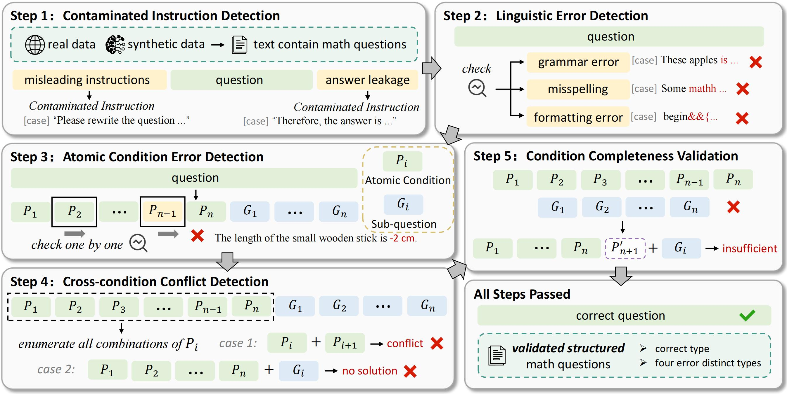

<div align="center">

# 🚀 MathQ-Verify

</div>

## 🔥 News
- 📁 **2025-05-21**: The **ValiMath dataset** has been released for research use.

## 🌟 Overview  
Large Language Models (LLMs) often generate **math problems with hidden flaws**, such as contradictions or missing premises. To address this issue, we propose **MathQ-Verify**, a **five-stage pipeline** designed to rigorously filter ill-posed math questions and improve the overall quality of math datasets.

## 🔍 Key Contributions  
1. **MathQ-Verify Framework**  
   - Detects various types of errors in math problems: contaminated instructions, linguistic errors, atomic condition flaws, logical contradictions, and completeness gaps.  
   - Achieves **90% precision** and **63% recall** using lightweight model voting strategies.  

2. **ValiMath Benchmark** 📊 
   - Contains **2,147 math questions** with **fine-grained stepwise validity labels** across **5 error categories**.  

3. **Comprehensive Evaluation** 📈  
   - Outperforms baseline methods by **+15% in F1 score** on the ValiMath benchmark.
   - Ablation studies demonstrate the effectiveness of each verification stage.

## 🧩 Framework  


## 📦 Dataset Overview  
We provide a high-quality dataset for evaluating math question validity. It includes:
- **2,147** math problems in total (split into correct and incorrect subsets).
- Each problem is annotated with **step-by-step validity labels**.
- Supports detailed analysis of error types such as **contradictions**, **incompleteness**, and **domain mismatches**.

## 🛠️ Usage  

The code is currently being prepared and will be uploaded soon.🙂

<!-- 
Example CLI usage (to be updated):
```bash
python mathq_verify.py --input your_math_questions.json
```
-->

---

## 📚 Citation  
If you find our work useful in your research, please cite:

```bibtex
@misc{anonymous2025mathqverify,
      title={Let's Verify Math Questions Step by Step}, 
      author={Anonymous Authors},
      year={2025},
      note={Under review}
}
```

---

## 🧠 Contact  
This repository is anonymized for review. Please check back after the review process for more information.

*Let’s build reliable math datasets together! 🚀*

---

> ✅ **Note**: This repository is under preparation for public release post-review. Some features and documentation may evolve before official publication.
